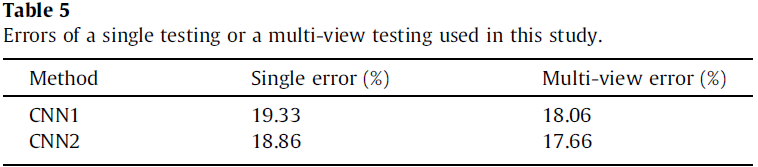
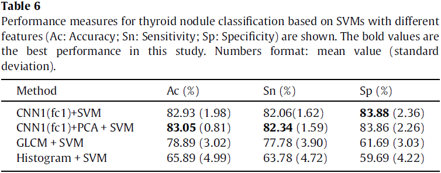

本文介绍并对比了 17 年至今 4 篇用深度学习方法做甲状腺结节诊断的论文。分别是：

天津市肿瘤医院：[Li X, Zhang S, Zhang Q, et al. Diagnosis of thyroid cancer using deep convolutional neural network models applied to sonographic images: a retrospective, multicohort, diagnostic study[J]. The Lancet Oncology, 2019, 20(2): 193-201.](https://www.sciencedirect.com/science/article/abs/pii/S1470204518307629)

马师姐：[Ma J, Wu F, Zhu J, et al. A pre-trained convolutional neural network based method for thyroid nodule diagnosis[J]. Ultrasonics, 2017, 73: 221-230.](https://www.sciencedirect.com/science/article/abs/pii/S0041624X16301913)

中山大学：[Li H, Weng J, Shi Y, et al. An improved deep learning approach for detection of thyroid papillary cancer in ultrasound images[J]. Scientific reports, 2018, 8(1): 6600.](https://www.nature.com/articles/s41598-018-25005-7)

杜克大学：[Buda M, Wildman-Tobriner B, Hoang J K, et al. Management of thyroid nodules seen on US images: deep learning may match performance of radiologists[J]. Radiology, 2019, 292(3): 695-701.](https://pubs.rsna.org/doi/full/10.1148/radiol.2019181343)

四篇文章用到的数据集和模型结果如下：

| 论文         | 训练集        | 测试集/验证集 | AUC         | Accuracy    | Sensitivity | Specificity |
| ------------ | ------------- | ------------- | ----------- | ----------- | ----------- | ----------- |
| 天津肿瘤医院 | 312399 images | 20386 images  | 0.908-0.947 | 0.857-0.889 | 0.843-0.922 | 0.856-0.871 |
| 马师姐       | 15000 images  | 10交叉验证    | 0.893       | 0.830       | 0.824       | 0.850       |
| 中山大学     | 200 cases     | 100 cases     |             |             | 0.935       | 0.815       |
| 杜克大学     | 1278 nodules  | 99 nodules    |             | 0.87        | 0.87        | 0.52        |

从图像数据集角度看，天津肿瘤医院用到的数据集是十万量级的，马师姐的文章是万量级的，后两篇文章则是千量级的，前两篇文章得到的模型和结果更可靠也更有说服力。

第三篇文章数据集较小，最终的结果也比较粗糙，只给出了了TPR、FPR、TNR、FNR等数据，没有AUC和Accuracy，得到的Sensitivity是四篇文章中最高的，Specificity也比较好，我觉得结果的准确性有待探究，毕竟文章中的模型是基于Faster R-CNN的优化，同时实现了甲状腺结节的检测和分类，数据集也不大，但结果却很好，我觉得本文不太可靠（文章中还出现了词汇和语法错误）。

第四篇文章最终得到的Accuracy和Sensitivity较好，和医生同水平，Specificity不如其他几篇文章，也是和医生同水平。文章中各方面的数据都比较详实，先用Faster R-CNN检测区域，再用CNN预测结节恶性概率等指标，最后将结果分层，思路比较清晰。这篇文章的主要局限性是数据集过小，尤其是测试集只包含了99个结节的图像（198张），测试结果的可靠性不足，需要更大的数据集作为支撑。

前两篇文章都取得了很好的结果，AUC、Accuracy和Sensitivity都和医生水平相同，Specificity优于医生。总的来看，天津肿瘤医院的结果略优于马师姐的结果，不过也是比较接近。两篇文章都采用了训练两个神经网络模型并结合的思路，天津肿瘤医院的方法是将两个独立的网络（ResNet-50和Darknet-19）得到的结果加权求和，马师姐的方法是将一深一浅两个网络最后的全连接层进行拼接，再预测结果。马师姐的文章比较早，用到的两个网络模型都较为简单（主要应用了不同深度网络特征提取能力不同的思想），如果采用新的深度比较大的网络，可能会取得更优的结果。

更详细的结果可见下面的总结和原论文。

# Paper 1

[Li X, Zhang S, Zhang Q, et al. Diagnosis of thyroid cancer using deep convolutional neural network models applied to sonographic images: a retrospective, multicohort, diagnostic study[J]. The Lancet Oncology, 2019, 20(2): 193-201.](https://www.sciencedirect.com/science/article/abs/pii/S1470204518307629)

## Dataset

Training set: 312399 images from 42952 individuals

- 17 627 patients with thyroid cancer (131 731 images) 
- 25 325 controls (180 668 images)

Validation set:

- Tianjin internal validation set: 8606 images from 1118 individuals
- Jilin external validation set: 741 images from 154 individuals
- Weihai external validation set: 11 039 images from 1420 individuals 

Clinicopathological information

## Procedures

Perform image quality control for the training set.

Use ResNet-50[^1] and Darknet-19[^2] for image classification. 

- Initialize the networks with weights trained on the ImageNet, except the last layer. 
- The weights of last layer were randomly initialized. 
- Two output units (thyroid cancer vs control). 
- Apply on-the-fly data augmentation[^3] for each image during training to avoid overfitting. 
- A weight decay rate of 0·0005 was also set to additionally combat for overfitting.

To derive individual-level prediction scores, denote $n$ as the total number of images available from a patient and let $P_{cancer}=[P_1, P_2, \cdots , P_n]$ denote the predicted probabilities for these $n$ images that were classified as cancer. The score $\theta$ assigned to the patient was defined as the average value of log-transformed $P_{cancer}$

$$
\theta = - [\ln (1-P_1) + \ln (1-P_2) + \cdots + \ln (1-P_n)] / n
$$

Combine the prediction scores obtained from ResNet-50 and Darknet-19, which is weighted by their performance (AUC). Define $w_1 = AUC_{res} / (AUC_{res} + AUC_{dark})$ and $w_2 = 1 - w_1$, then

$$
\theta_{combined} = w_1 \times \theta_{res} + w_2 \times \theta_{dark}
$$

## Results

The model achieved high performance in identifying thyroid cancer patients in the validation sets tested, with AUC values of 0·947 for the Tianjin internal validation set, 0·912 for the Jilin external validation set, and 0·908 for the Weihai external validation set. 

### Comparison

To compare the performance of the ensemble DCNN model with the ultrasound radiologists, they randomly selected some individuals from the validation sets. 500 of 1118 individuals from the Tianjin set (3734 of 8606 images), 274 of 1420 individuals from the Weihai set (2233 of 13 949 images), and all 154 individuals from the Jilin set (all 741 images) were selected, and these images were used to assess the performance of the ensemble DCNN model versus the group of six skilled thyroid ultrasound radiologists. 

**The ensemble DCNN model had significantly higher accuracy and specificity and comparable sensitivity across these three validation sets. Additionally, the model had higher kappa coefficient, positive predictive value, and F₁ score compared with the performance of the radiologists.**

Note: metrics of the ensemble DCNN model in the upper table have minor discrepancy with the results calculated from the confusion matrix in the appendix. 

## Discussion

1. The study lacked validation in different geographic setting. They did not include training data from other hospitals. Most patients in the cohorts are northern Han Chinese. Multicenter training cohorts were needed. 
2. They did not do sensitivity analyses with respect to tumour size and subtypes of malignant disease. Except for the papillary carcinoma, other thyroid cancer subtypes with low incidence were not well represented in the training set. 
3. 19674 individuals of the 25325 control individuals didn't undergo surgery, because they didn't show any evidence associated with thyroid malignancy in clinical testing. These patients would be mainly negative diagnoses. 
4. Because the algorithm was trained only with images from anatomical sites that did have cancer, and the probability of cancer was calculated by averaging logarithmic transformation of one minus probabilities from each image, the algorithm could report a lower score in a clinical trial, when non-cancer site images would not be removed, leading to decreased sensitivity. 
5. Radiologists in this study did not analyse lymph node images to support their diagnosis. A TI-RADS score of 5 was the only condition to score nodules as malignant. 
6. In this study, the deep convolutional neural network models were merely developed on the basis of sonographic images. Given that thyroid cancer is a complex and heterogeneous disease, data from multiple sources, such as demographic characteristics, laboratory test results, and images, are available in practical clinical scenarios. To create a reliable diagnostic model, a more robust deep learning model combining different types of medical data sources is encouraged.
7. In this study the classification model was developed without the provision of any information about ultrasonography features. More precisely, features learned by the DCNN model were not linked to ultrasound features defined by the ACR TI-RADS. 

# Paper 2

[Ma J, Wu F, Zhu J, et al. A pre-trained convolutional neural network based method for thyroid nodule diagnosis[J]. Ultrasonics, 2017, 73: 221-230.](https://www.sciencedirect.com/science/article/abs/pii/S0041624X16301913)

## Dataset

8148 thyroid nodules (4126 benign + 4022 malignant) acquired from 4782 patients are studied. Each nodule has several longitudinal cutting maps or crosscutting maps, coming to 15000 images in total. 

The boundary of thyroid nodule in each image is manually delineated by physicians. 

## Methods

Note: Text description may have contradictions. The specific details are subject to the code.

### Architectures

In this study, based on two proposed CNN architectures (referred to as CNN1 and CNN2, see Table 2), a **fused CNN** is designed to diagnose thyroid nodules. 

The **fused CNN** architecture (see Fig. 5) is based on CNN1 and CNN2, which consists of all the layers of the two CNNs. The size of filters and strides of  these layers are all the same as the corresponding layers of two CNNs are, respectively. This structure can take advantage of CNN1 to capture the subtle low level features, and CNN2 to capture the complex high-level features from thyroid nodules so that it can learn multiple levels of features from thyroid nodules. Feature maps from six fully-connected layers are fused by a sumlayer to train a softmax.

### Implementation

10-fold cross validation was performed in all experiments with the same dataset. 

***Training a single CNN***

The CNN architectures are **pre-trained** with the ImageNet database. Image patches of size 225 × 225 cropped sampled randomly from thyroid nodule images are the inputs, whose centers are in their corresponding masks. Then the whole networks is fine-tuned by backpropagation with SGD, and simultaneously computes discriminative feature maps. Finally, these feature maps are used to train a softmax for classifying thyroid nodules. 

***Training the fused CNN***

Training the fusion model is based on the two CNN architectures above. Firstly, as the way of training above, two networks (CNN1 and CNN2) with different convolutional layers and fully-connected layers are trained separately. Secondly, fuse the multi-level feature maps learned by the two trained CNNs in multi-view testing. Finally, use the fused feature maps to train a softmax classifier for thyroid nodules classification (see Fig. 6). 

***Testing***

In the testing step, they adopted a strategy of **multi-view** to improve the performance. Specifically, 225 × 225 cropped 256 views sampled randomly from each thyroid nodule image were the inputs of trained  CNNs and the outputs were the average results of 256 views. 

### Other details

- activation function: parametric rectified linear unit (PReLU)
- local response normalization
- 2-way softmax after the fc3 layer
- cross entropy loss
- learning rate: 0.02 (applied to the gradient on a minibatch 10)
- weight decay and bias decay: 0.0005
- momentum: 0.9 (linearly over 10 epochs)
- split Dropout (sDropout)[^4]: reduce overfitting. 

## Results

The classification performance of these architectures are reported in terms of average classification accuracy, sensitivity and specificity, with standard deviation (see Table 4). The fused CNN's performance is better. 

The single and multi-view testing errors are shown in Table 5. It can be observed that a clear improvement of multi-view compared to single view, demonstrating that the high-level features of the individual CNN based models provide a robust representation of the input images. 

The authors compared the performance of SVM based methods with feature maps learned by CNN1, GLCM features, histogram features, respectively (see Table 6). The results show that feature maps learned by CNN are more effective than GLCM and histogram features are. Moreover, PCA can improve the performance of SVM with feature maps learned by CNN. 

Fig. 11 depicts the classification accuracy of different methods in this study. It can be observed from the results that CNN based methods outperform other methods in classifying thyroid nodules. 

See the original paper for the rest results. 

## Discussion

This study is the first attempt to use CNNs for thyroid nodule diagnosis. 

CNN based methods have many advantages: 

- CNNs can avoid the potential errors caused by inaccurate image preprocessing results (e.g., boundary segmentation), as well as the classification bias resulting from a less robust feature set.
- CNNs can automatically effective features from 2D thyroid nodule images without any assumptions about the relevant visual features, compared with the conventional methods. 
- CNNs can be suitable to deal with the intrinsically noisy property of ultrasound image from various sonographic systems. 
- CNNs can also take full advantage of the 2D structure of an input image.
- CNNs are invariant for geometry transformation, deformation and illumination in a certain degree.

The dataset is not enough to get a higher accuracy because the dataset cannot adequately cover or represent the actual population base in the clinical practice.

The network in this study is simpler and shallower than those of the newest architectures. 

# Paper 3

[Li H, Weng J, Shi Y, et al. An improved deep learning approach for detection of thyroid papillary cancer in ultrasound images[J]. Scientific reports, 2018, 8(1): 6600.](https://www.nature.com/articles/s41598-018-25005-7)

There are some vocabulary and grammatical errors in this paper. 

## Dataset

300 cases
- 53 males and 247 females at the age of 10–85 years
- 250 cases were diagnosed with papillary thyroid cancer and underwent surgery. The other 50 cases were diagnosed with thyroid normal. 
- Each case has 5–25 ultrasound images and the sum is 4670. Each image of the diagnosed case has 1–3 cancer regions.

200 diagnosed cases were selected as training samples. The remaining 100 cases (50 diagnosed cases and 50 normal cases) are used for test samples. 

## Methods

The authors improved the original Faster R-CNN[^5] to do thyroid papillary cancer detection. In CNN used in Faster R-CNN, the conv3 layer and conv5 layer of ZF was concatenated and normalized. In addition, a spatial constrained layer was added before the output layer. 

As shown in Fig. 2, they applied L2 normalization to tensors in the conv3 layer and the conv5 layer[^6]. They made the normalization within each pixel in the pooled feature map tensor. After the normalization, scaling was applied on each tensor independently. This strategy could enhance the ability of detector to capture more detail features of the RoI, especially for low-resolution images. 

According to the authors, the output y may not only depend on the input x alone, but also on the topological domain region on which it is residing. In order to extract features from the unknown residing regions, as shown in Fig. 2, they added a Spatial constrained layer before the output layer. By using spatial constrained layer, the detection could extract the features of surrounding host environment in which the cancer regions are residing. 

Because of the lack of training samples, they pre-trained Faster R-CNN using VOC2007 database. During fine-tuning, we take the approximate joint training scheme in[^5] to train the RPN and detector simultaneously using multitask loss. 

## Results

 93.5% (TPR) of papillary thyroid carcinoma regions can be detected automatically while 81.5% (TNR) of benign and normal tissue can be excluded without using any additional immunohistochemical markers or human intervention. The AUC of this method is 0.938. Therefore, the potential of this new methodology could reduce the workload for pathologists and increase the objectivity of diagnoses. 

Experimental results show that each strategy can improve the functioning of the detection. Combining all of the strategies yields the best results.

# Paper 4

[Buda M, Wildman-Tobriner B, Hoang J K, et al. Management of thyroid nodules seen on US images: deep learning may match performance of radiologists[J]. Radiology, 2019, 292(3): 695-701.](https://pubs.rsna.org/doi/full/10.1148/radiol.2019181343)

The purpose of this study is to develop a deep learning algorithm that uses thyroid US images to decide whether a thyroid nodule should undergo a biopsy and to compare the performance of the algorithm with the performance of radiologists who adhere to ACR TI-RADS. 

## Dataset

Included were 1377 thyroid nodules (two orthogonal US images) in 1230 patients with complete imaging data and conclusive cytologic or histologic diagnoses. In the final sets for the analysis, there were 1278 nodules from 1139 patients in the training set and 99 nodules from 91 patients in the test set (Fig 1). The 99 test nodules were not used during algorithm development. 

The total number of malignant nodules was 142 (of 1377 nodules); there were 127 malignant nodules (of 1278 nodules) in the training set and 15 malignant nodules (of 99 nodules) in the test set.

## Methods

The proposed deep learning algorithm had three main stages: nodule detection followed by prediction of malignancy and risk-level stratification. Figure 2 shows these stages and how they are connected.

For nodule detection, they first obtained a bounding box of a nodule by using Faster R-CNN. 

For classification, they trained a custom, multitask deep CNN. The tasks used for training were presence or absence of malignancy and all of the ACR TI-RADS features across the five categories (composition, echogenicity, shape, margin, and echogenic foci). The architecture is shown in Figure 3.

For risk-level stratification, they stratified the probability of malignancy returned by the network into risk levels referred to as deep learning risk levels (ie, DL2–DL5), modeled after the ones defined in ACR TI-RADS (ie, TR2–TR5). Use of the deep learning risk level and a nodule’s size resulted in a recommendation for FNA and follow-up.

Finally, they evaluated they deep learning algorithm and compared it with the performance of radiologists in two steps (Figure 4). 

## Results

For the training set, AUC of the deep learning algorithm was compared with that of a single radiologist. On the test set, they compared the deep learning algorithm with consensus of the three ACR TI-RADS committee members and the nine other radiologists. 

For the training set of 1278 nodules, evaluated by using 10-fold cross-validation, the deep learning algorithm achieved an AUC of 0.78 compared with 0.80 for a single ACR TIRADS committee radiologist by using ACR TI-RADS (Fig 5a). 

For the test set for discriminating malignant and benign nodules, deep learning achieved an AUC of 0.87, which is comparable to that of expert consensus (0.91). The mean AUC of the nine radiologists was 0.82; the lowest AUC was 0.76 and the highest AUC was 0.85. 

For the 99 test nodules, the proposed deep learning algorithm achieved 13 of 15 (87%) sensitivity, the same as expert consensus (P . .99) and higher than five of nine radiologists. The specificity of the deep learning algorithm was 44 of 84 (52%), which was similar to expert consensus (43 of 84; 51%; P = .91) and higher than seven of nine other radiologists. The mean sensitivity and specificity for the nine radiologists was 83% and 48%, respectively. 

[^1]: [He K, Zhang X, Ren S, et al. Deep residual learning for image recognition[C]//Proceedings of the IEEE conference on computer vision and pattern recognition. 2016: 770-778.](http://openaccess.thecvf.com/content_cvpr_2016/html/He_Deep_Residual_Learning_CVPR_2016_paper.html)

[^2]: [Redmon J, Farhadi A. YOLO9000: better, faster, stronger[C]//Proceedings of the IEEE conference on computer vision and pattern recognition. 2017: 7263-7271.](http://openaccess.thecvf.com/content_cvpr_2017/html/Redmon_YOLO9000_Better_Faster_CVPR_2017_paper.html)

[^3]: [Chang K, Bai H X, Zhou H, et al. Residual convolutional neural network for the determination of IDH status in low-and high-grade gliomas from MR imaging[J]. Clinical Cancer Research, 2018, 24(5): 1073-1081.](http://clincancerres.aacrjournals.org/content/24/5/1073.abstract)

[^4]: [Wu F, Hu P, Kong D. Flip-rotate-pooling convolution and split dropout on convolution neural networks for image classification[J]. arXiv preprint arXiv:1507.08754, 2015.](https://arxiv.org/abs/1507.08754)

[^5]: [Ren S, He K, Girshick R, et al. Faster r-cnn: Towards real-time object detection with region proposal networks[C]//Advances in neural information processing systems. 2015: 91-99.](http://papers.nips.cc/paper/5638-faster-r-cnn-towards-real-time-object-detection-with-region-proposal-networks)

[^6]: [Liu W, Rabinovich A, Berg A C. Parsenet: Looking wider to see better[J]. arXiv preprint arXiv:1506.04579, 2015.](https://arxiv.org/abs/1506.04579)