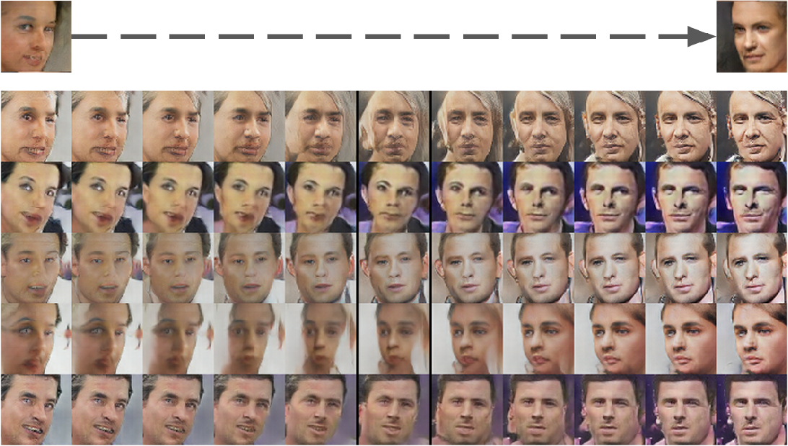

[Radford, Alec, Luke Metz, and Soumith Chintala. "Unsupervised representation learning with deep convolutional generative adversarial networks." *arXiv preprint arXiv:1511.06434* (2015).](https://arxiv.org/pdf/1511.06434.pdf)

The following is my reading notes of this paper. 

## 1 Introduction
In this paper, they propose that one way to build image representations is by training GANs[^1], and later reusing parts of the generator and discriminator networks as feature extractors for supervised tasks.

GANs have been known to be unstable to train, often resulting in generators that produce nonsensical outputs.

Authors' contributions: 
- They propose and evaluate a set of constraints on the architectural topology of Convolutional GANs that make them stable to train in most settings. They name this class of architectures Deep Convolutional GANs (**DCGAN**).
- They use the trained discriminators for image classification tasks, showing competitive performance with other unsupervised algorithms.
- They visualize the filters learnt by GANs and empirically show that specific filters have learned to draw specific objects.
- They show that the generators have interesting vector arithmetic properties allowing for easy manipulation of many semantic qualities of generated samples.

## 2 Related Work
### 2.1 Representation Learning from unlabeled data
- do clustering on the data (e.g. K-means)[^2]
- train auto-encoders
  - stacked denoising autoencoders[^3]
  - stacked what-where autoencoders[^4]
  - ladder structures[^5]
- DBN[^6]

### 2.2 Generating natural images

### 2.3 Visualizing the internals of CNNs

## 3 Approach and Model Architecture
 

**Summary - architecture guidelines for stable DCGANs:** 
- **Replace any pooling layers with strided convolutions[^7] (discriminator) and fractional-strided convolutions (generator).** This makes the model to learn its own upsampling/downsampling.
- **Use Batch Normalization[^8] in both the generator and the discriminator.** BN stabilizes learning by normalizing the input to each unit to have zero mean and unit variance and help gradient flow in deeper models. To avoid sample oscillation and model instability, do not apply BN to the generator output layer and the discriminator input layer. 
- **Remove fully connected hidden layers for deeper architectures.** Global average pooling[^9] increased model stability but hurt convergence speed.
- **Use ReLU activation in generator for all layers except for the output, which uses Tanh.** Using a bounded activation allows the model learn more quickly to saturate and cover the color space of the training distribution.
- **Use LeakyReLU activation in the discriminator for all layers, in contrast to the maxout activation which is used in the original GAN.** 

## 4 Details of adversarial training
- Datasets: 
  - Large-scale Scene Understanding (LSUN)[^10]
  - Imagenet-1k
  - a newly assembled Faces dataset
- No pre-processing was applied to training images besides scaling to the range of the tanh activation function $[-1, 1]$.
- All models were trained with mini-batch SGD with mini-batch size of $128$.
- All weights were initialized from Normal distribution $\mathcal{N}(0, 0.02)$.
- In the LeakyReLU, the slope of the leak was set to $0.2$ in all models.
- Use Adam optimizer[^11] with tuned hyperparameters. 
- Learning rate is $0.0002$ ($0.001$ is too high). 
- Reduce the momentum term $\beta_{1}$ from the suggested value $0.9$ to $0.5$ which helped stabilizing training. 

### 4.1 LSUN
By showing samples from one epoch of training, in addition to samples after convergence, they demonstrate that the model is not producing high quality samples via simply overfitting/memorizing training examples.

#### 4.1.1 Deduplication

### 4.2 Faces

### 4.3 Imagenet-1k

## 5 Empirical Validation of DCGANs capabilities
### 5.1 Classifying CIFAR-10 using GANs as a feature extractor
To evaluate the quality of the representations learned by DCGANs for supervised tasks, they train the model on Imagenet-1k and test it on CIFAR-10 (flatten and concatenate the features,  then train a regularized linear L2-SVM classifier on top of them), achieving a good result. 

### 5.2 Classifying SVHN digits using GANs as a feature extractor
Following preparation as in the CIFAR-10 experiments, they achieve SOTA test error on the SVHN dataset. Additionally, they train a purely supervised CNN with the same architecture on the same data and get a much worse result, which demonstrates that the CNN architecture in DCGAN is not the key contributing factor. 

## 6 Investing and visualizing the internals of the networks
### 6.1 Walking in the latent space
   

### 6.2 Visualizing the Discriminator Features
 

### 6.3 Manipulating the Generator Representation
#### 6.3.1 Forgetting to draw certain objects
![Figure 6: Top row: un-modified samples from model. Bottom row: the same samples generated with dropping out ”window” filters. Some windows are removed, others are transformed into objects with similar visual appearance such as doors and mirrors. Although visual quality decreased, overall scene composition stayed similar, suggesting the generator has done a good job disentangling scene representation from object representation. Extended experiments could be done to remove other objects from the image and modify the objects the generator draws. ](../images/2019-11-19-DCGAN/8-Figure6-1.png)

#### 6.3.2 Vector arithmetic on face samples
 ![Figure 7: Vector arithmetic for visual concepts. For each column, the Z vectors of samples are averaged. Arithmetic was then performed on the mean vectors creating a new vector Y . The center sample on the right hand side is produce by feeding Y as input to the generator. To demonstrate the interpolation capabilities of the generator, uniform noise sampled with scale +-0.25 was added to Y to produce the 8 other samples. Applying arithmetic in the input space (bottom two examples) results in noisy overlap due to misalignment.](../images/2019-11-19-DCGAN/9-Figure7-1.png)

   

## 7 Conclusion and Future Work
"We propose a more stable set of architectures for training generative adversarial networks and we give evidence that adversarial networks learn good representations of images for supervised learning and generative modeling."

Remaining forms of model instability - as model are trained longer they sometimes collapse a subset of filters to a single oscillating mode.

[^1]: [Goodfellow, Ian, et al. "Generative adversarial nets." *Advances in neural information processing systems*. 2014.](http://papers.nips.cc/paper/5423-generative-adversarial-nets)

[^2]: [Coates, Adam, and Andrew Y. Ng. "Learning feature representations with k-means." Neural networks: Tricks of the trade. Springer, Berlin, Heidelberg, 2012. 561-580.](https://www-cs.stanford.edu/~acoates/papers/coatesng_nntot2012.pdf)

[^3]: [Vincent, Pascal, et al. "Stacked denoising autoencoders: Learning useful representations in a deep network with a local denoising criterion." Journal of machine learning research 11.Dec (2010): 3371-3408.](http://www.jmlr.org/papers/volume11/vincent10a/vincent10a.pdf)

[^4]: [Zhao, Junbo, et al. "Stacked what-where auto-encoders." arXiv preprint arXiv:1506.02351 (2015).](https://arxiv.org/pdf/1506.02351)

[^5]: [Rasmus, Antti, et al. "Semi-supervised learning with ladder networks." Advances in neural information processing systems. 2015.](http://papers.nips.cc/paper/5947-semi-supervised-learning-with-ladder-networks.pdf)

[^6]: [Lee, Honglak, et al. "Convolutional deep belief networks for scalable unsupervised learning of hierarchical representations." Proceedings of the 26th annual international conference on machine learning. ACM, 2009.](http://people.ee.duke.edu/~lcarin/DeepBelief.pdf)

[^7]: [Springenberg, Jost Tobias, et al. "Striving for simplicity: The all convolutional net." *arXiv preprint arXiv:1412.6806* (2014).](https://arxiv.org/pdf/1412.6806.pdf)

[^8]: [Ioffe, Sergey, and Christian Szegedy. "Batch normalization: Accelerating deep network training by reducing internal covariate shift." *arXiv preprint arXiv:1502.03167* (2015).](https://arxiv.org/pdf/1502.03167.pdf)

[^9]: [Inceptionism: Going Deeper into Neural Networks](http://ai.googleblog.com/2015/06/inceptionism-going-deeper-into-neural.html)

[^10]: [Yu, Fisher, et al. "Lsun: Construction of a large-scale image dataset using deep learning with humans in the loop." *arXiv preprint arXiv:1506.03365* (2015).](https://arxiv.org/pdf/1506.03365)

[^11]: [Kingma, Diederik P., and Jimmy Ba. "Adam: A method for stochastic optimization." arXiv preprint arXiv:1412.6980 (2014).](https://arxiv.org/pdf/1412.6980.pdf%20%22%20entire%20document)